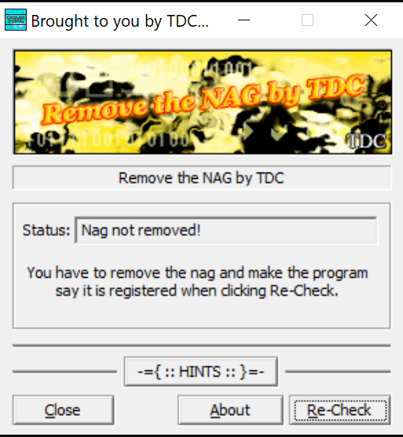
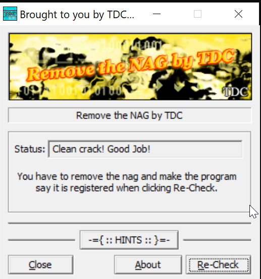
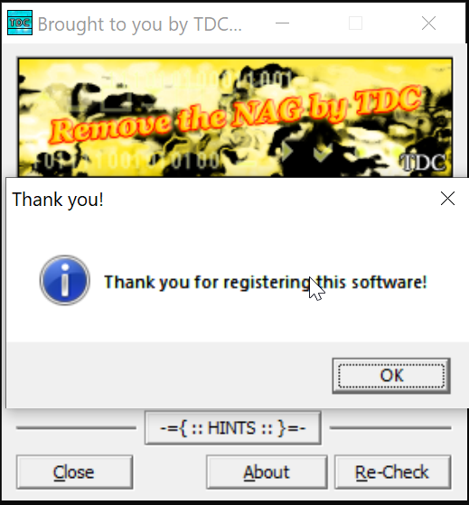
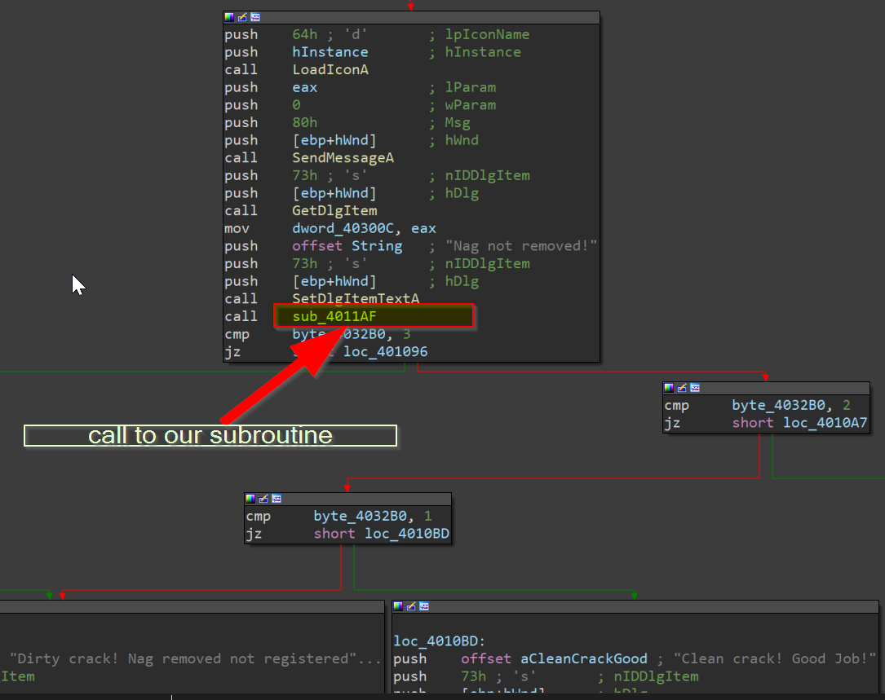
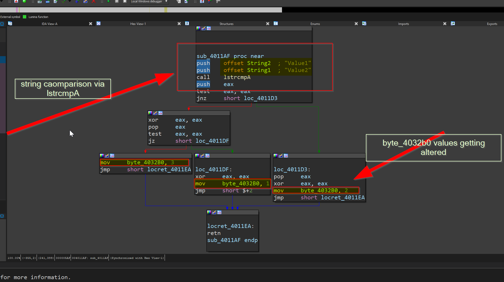

# 📸 Screenshots – Visual Patching Guide

This folder contains annotated screenshots from the "Remove the Nag" CrackMe reverse engineering process.

---

## 🧩 File Previews

### ❗ `nag.png`
The initial "nag" screen that appears when the program is launched unmodified.

---

### 🧠 `before.png`
The binary’s main window before patching, showing the default UI and nag message.

---

### 🎉 `after.png`
Post-patch window showing the success state — the message box and status bar now reflect a successful "registration."

---

### 🔁 `recheck.png`
The "Re-Check" button behavior pre-patch. Clicking this triggers the subroutine we modified.

---

### 🔗 `call.png`
The main function's control flow calling the subroutine we patched (`sub_4011AF`).

---

### 🔍 `lstrcmpA.png`
Disassembly view of the key string comparison logic using `lstrcmpA`. This is where we changed the arguments to ensure a match.

